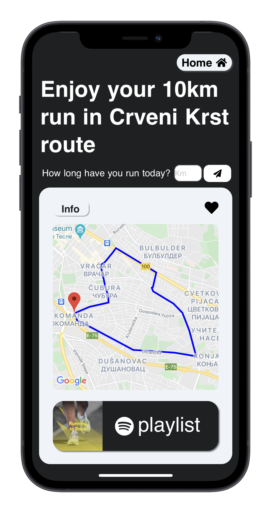
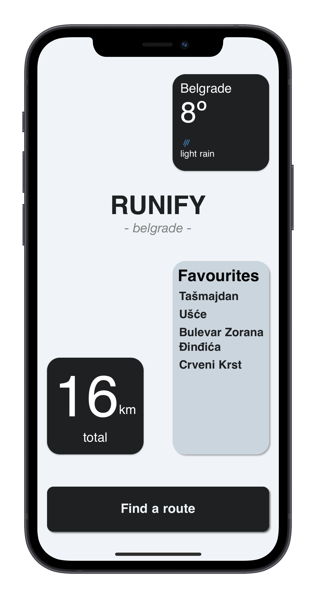

<h1>
Runify Belgrade
</h1>

Find the running route in Belgrade that suits you.

:runner: :musical_note: ​Runify Belgrade lets you choose where and how long would you like to run. Based on your inputs it shows you the best path for you. It, also, creates a Spotify Playlist which matches your current mood.

:checkered_flag: :partly_sunny: You can track your running progress as well as the current weather in Belgrade.

  

  

## Tech Stack

- [React Native](https://reactnative.dev/)
- [Expo](https://expo.io/)
- [Node.js](https://nodejs.org/)
- [Express](https://expressjs.com)
- [Mongoose](https://mongoosejs.com/)

## Getting started

Get yourself setup with your favourite code editor, a local Mongo DB running on your machine and expo for your phone.

1. Fork and clone the repo onto your computer
2. Rename a config.public.js file to config.js file in /client.
3. If you want weather to be shown ask for the api [here](https://openweathermap.org/api), and replace it in the config.js file. Replace the IP with your IP adress.
4. Rename a config.public.js file to config.js file in /server.
5. Add your port as well as your secret key
6. `cd server && npm i && nodemon`
7. `cd client && npm i && expo start`
8. Login with email: admin, password: admin

## Currently developing...

- Authorization
- Refactoring the front end to cleaner and more readable code

## Room For Improvement

- Converting it to Type Script, for more readable and maintanable code
- Improving styling
- Deployment
